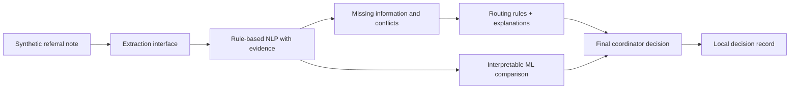
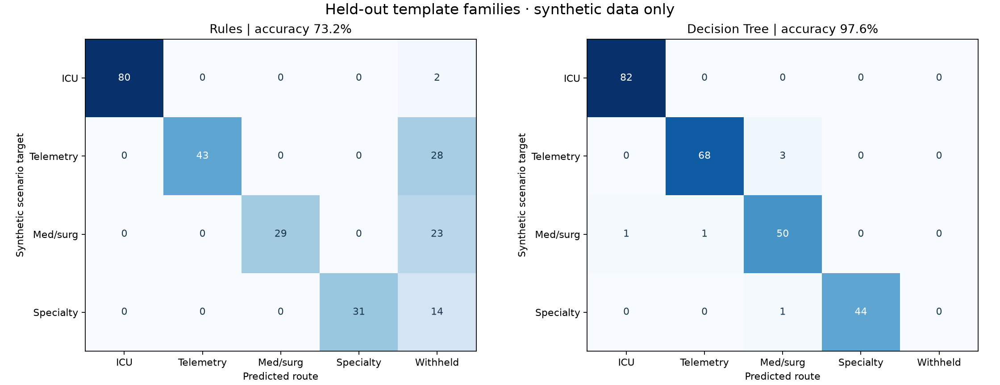
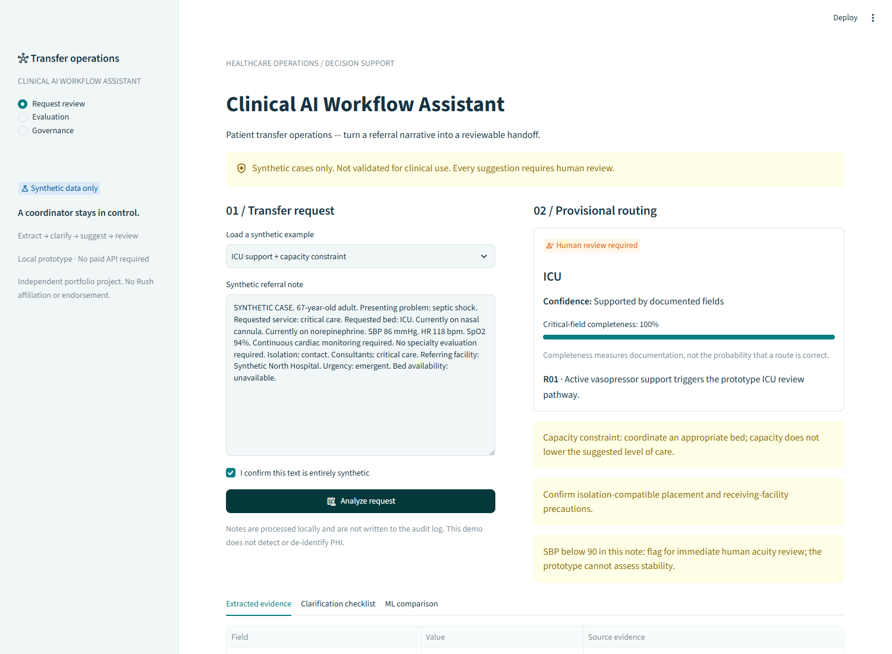
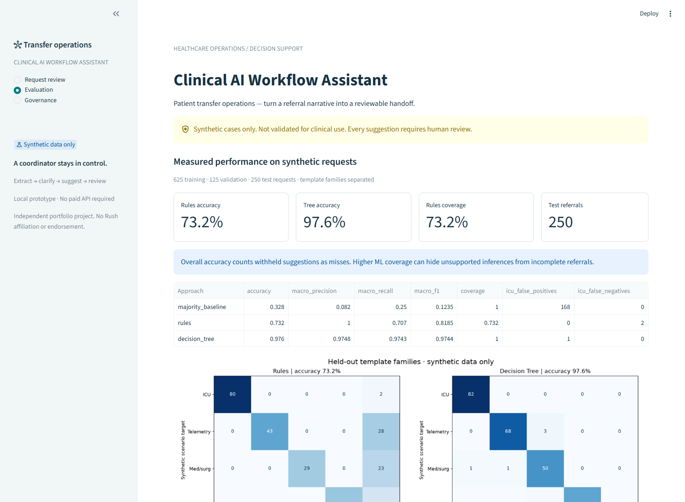

# Clinical AI Workflow Assistant for Patient Transfer Operations

An interview-ready healthcare operations portfolio project connecting transfer-center nursing workflow with reproducible data science. Built for an RN Clinical Placement Coordinator with 12 years of clinical experience and an MS in Data Science pursuing Healthcare AI Solutions Analyst roles.

**Synthetic data only. Decision support only. Not validated for clinical use. Not affiliated with or endorsed by Rush University Medical Center.**

## Two projects in this repository

| | |
|---|---|
| **Repository root** | **Clinical AI Workflow Assistant** — rule-based NLP extraction with evidence, an interpretable routing model, and a human review workbench. Documented below. |
| [`decline-prediction/`](decline-prediction/README.md) | **Transfer Center Decline Prediction & Payer-Equity Audit** — logistic regression on a synthetic request extract, with the operating threshold chosen on validation by weighted error cost, plus a chi-square and covariate-adjusted payer-equity audit. |

They are independent: separate Python packages, dependency files, test suites, CI jobs, and deployed Streamlit apps. Run each from its own directory.

## Healthcare problem

Interhospital transfer referrals arrive as incomplete, inconsistent narratives. Coordinators must identify clinical support needs, clarify missing details, contact the appropriate service, and reconcile placement with capacity. This prototype turns a synthetic referral into a reviewable summary and a provisional routing suggestion. A human retains responsibility for verification, acceptance, level of care, transport, and placement.

## Architecture



The extraction interface supports a future optional LLM adapter. The default pipeline runs locally without credentials or paid APIs. Bed availability affects the operational warning, never the inferred clinical support requirement. Specialty review is an escalation workflow, not a physical bed category.

```text
app.py                         Streamlit review workbench
src/transfer_assistant/         Synthetic generator, extraction, routing, ML, audit
scripts/                       Reproducible build and notebook execution
data/synthetic/                Generated requests and dataset validation
artifacts/                     Trained model and reproducibility metadata
reports/                       Actual metrics, errors, figures, subgroup results
notebooks/                     Five numbered, executable analyses
docs/                          Model card, data dictionary, architecture, screenshots
tests/                         Safety behavior, data, pipeline and app checks
```

## Methodology and evaluation plan

Generate 1,000 fictional adult referrals from scenario specifications with variable wording, omitted fields, operational context, and deliberately challenging notes. Preserve complete synthetic scenario truth separately from note-visible annotations. Split training, validation, and test data by narrative template family so identical prose templates do not appear in training and test. Train an interpretable decision tree using extracted fields only. Exclude scenario labels, outcomes, IDs, and hidden source fields from model inputs.

Compare rules and ML on the same held-out test records. Report accuracy, per-class precision/recall/F1, macro F1, confusion matrices, ICU false positives/negatives, abstention coverage, extraction performance, missing-information performance, and concrete failures. Synthetic scenario labels are authored assumptions, not clinician-adjudicated ground truth; no metric establishes real-world safety.

## Actual results

The executed 250-record development test partition produced:

| Approach | Accuracy | Macro precision | Macro recall | Macro F1 | Coverage |
|---|---:|---:|---:|---:|---:|
| Majority baseline | 32.8% | 0.082 | 0.250 | 0.123 | 100% |
| Rules | 73.2% | 1.000 | 0.707 | 0.818 | 73.2% |
| Decision tree | 97.6% | 0.975 | 0.974 | 0.974 | 100% |

**These are synthetic benchmark results, not evidence of clinical performance.** Rules correctly routed 183 requests and withheld 67; overall accuracy counts withholding as a miss. The tree made six routing errors, including one ICU false positive. Rules had two ICU false negatives, both withheld suggestions, and no ICU false positives. No ICU false negatives occurred for the tree in these 82 fictional ICU test cases; that does not establish safety.

All 16 extracted fields and the critical missing-information detector scored 1.000 on supported generated prose. This reflects a shared, bounded vocabulary. A separately authored 18-case language challenge suite passed **17 of 20 field assertions**, with failures on a pressor abbreviation, a hypothetical device statement, and an isolation synonym. The actual cases are preserved in [challenge results](reports/challenge_results.csv).

Hyperparameters were selected on validation macro-F1, with a depth-6 tree and minimum leaf size 12. Test records were excluded from model fitting and hyperparameter selection. **Test diagnostics informed parser bug fixes**, so this is a development benchmark rather than an untouched external evaluation. The generator strongly correlates physiology and service with the target, simplifying the ML task. See [full results and failure examples](reports/RESULTS.md), [per-field metrics](reports/extraction_metrics.csv), [subgroups](reports/subgroups.csv), and [run manifest](artifacts/run_manifest.json).



## Application screenshots

Actual local Streamlit captures, using fictional referrals:





## Run locally

Use Python 3.12 (Python 3.11+ is supported by project metadata). From the project directory:

```powershell
python -m venv .venv
.\.venv\Scripts\python.exe -m pip install -e ".[dev]"
.\.venv\Scripts\python.exe scripts/build_project.py
.\.venv\Scripts\python.exe scripts/evaluate_challenges.py
.\.venv\Scripts\python.exe -m streamlit run app.py
```

On macOS/Linux, use `.venv/bin/python` in place of `.\.venv\Scripts\python.exe`. Open `http://127.0.0.1:8501`. The rule-based app also works without a trained model; build the artifacts to enable its ML comparison and evaluation view. No credentials, paid APIs, or network inference are required after dependency installation.

`requirements-lock.txt` records the exact Windows/Python 3.12 environment used for the reported run. To reproduce that environment, install it first with `python -m pip install -r requirements-lock.txt`, then install the local package with `python -m pip install --no-deps -e .`. On other operating systems use the portable `pyproject.toml` dependencies; the Windows snapshot contains platform-specific packages. The manifest records versions and a dataset SHA-256.

### Verify and explore

```powershell
.\.venv\Scripts\python.exe -m pytest -q
.\.venv\Scripts\python.exe scripts/execute_notebooks.py
.\.venv\Scripts\python.exe -m jupyterlab
```

All five notebooks include executed outputs:

1. [Generate and validate data](notebooks/01_generate_validate_data.ipynb)
2. [Exploratory analysis](notebooks/02_exploratory_analysis.ipynb)
3. [NLP extraction](notebooks/03_nlp_extraction.ipynb)
4. [Routing model](notebooks/04_routing_model.ipynb)
5. [Model evaluation](notebooks/05_model_evaluation.ipynb)

`scripts/generate_data.py` regenerates only the dataset. `scripts/build_project.py` regenerates data, fits the selected tree, and writes reports. `scripts/create_notebooks.py` rebuilds notebook source and clears outputs; rerun notebook execution afterward. GitHub Actions includes pipeline, test, and notebook checks; the workflow has been prepared locally, not run on GitHub.

## Final coordinator decision and local record

Load an example or paste fictional text, confirm it is synthetic, and analyze. Review each normalized field alongside its source evidence. Clarify absent/conflicting data, inspect the routing rationale and warnings, and compare the experimental tree if helpful. The coordinator then accepts the suggested route or chooses a different route, enters a fictional reviewer name and decision rationale, and explicitly acknowledges the review.

Decisions append to local `audit/decisions.jsonl` and can be downloaded as a decision record. Raw notes and extracted clinical values are excluded from the log. The note hash, decision rationale, fictional reviewer name, suggested and final routes, rule IDs, and versions are retained. Editing a note clears its analysis and decision state. Recording a final decision takes no transfer action. Logs and local model binaries are gitignored.

## Limitations and next steps

- Authored adult scenarios, English vocabulary, a single generator, and strongly correlated physiology do not represent real transfer-center practice.
- Routing rules are prototype assumptions, not Rush policies or validated clinical criteria. HFNC/NIV placement and specialty acceptance vary by institution.
- Unknowns can trigger abstention; the checklist is not a complete referral or stability assessment. Temporal and linguistic errors remain documented.
- Confidence labels describe evidence availability. Completeness is not a calibrated probability, and tree leaf proportions are uncalibrated.
- No real-patient testing, external clinical adjudication, fairness validation, prospective evaluation, or measured workflow benefit has occurred.
- The localhost app has no PHI detection, authentication, immutable audit storage, live bed feed, EHR integration, or production security controls.

The next meaningful step is clinician-led workflow and rule validation, followed by an approved, independently adjudicated evaluation and silent prospective study—not deployment into patient care. Read the [model card](docs/MODEL_CARD.md), [data dictionary](docs/DATA_DICTIONARY.md), [architecture](docs/ARCHITECTURE.md), and [interview walkthrough](docs/INTERVIEW_GUIDE.md).

## Governance references

The design exposes evidence and requires human review, informed by [FDA clinical decision support guidance](https://www.fda.gov/regulatory-information/search-fda-guidance-documents/clinical-decision-support-software) and the [NIST AI Risk Management Framework](https://www.nist.gov/itl/ai-risk-management-framework). These references do not validate the prototype's routing rules or establish its regulatory status.
